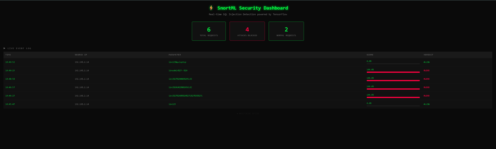

# SnortML SQL Injection Detector

A real-time SQL injection detection system using Machine Learning (TensorFlow) integrated with network traffic capture, as an open-source alternative to premium security solutions like Zenarmor.

## Architecture

Attacker → Network Interface (enp0s3) → snort_bridge.py → ml_service.py (Flask :5000) → BLOCK/ALLOW → dashboard.py (Flask :8080) → Browser Dashboard

## What I achieved

- ✅ TensorFlow model trained on 16,000 samples (100% accuracy)
- ✅ Real-time network traffic capture with Scapy
- ✅ Detection of classic SQL injection attacks
- ✅ Detection of URL-encoded obfuscated attacks
- ✅ Detection of UNION, time-based, stacked query attacks
- ✅ Live web dashboard showing attacks in real-time
- ✅ Full integration with Snort 3

## Why I built this

I wanted to replace Zenarmor Premium with my own AI-based solution using Snort 3 and TensorFlow. The goal was to learn how zero-day detection works and have a real project in my portfolio.

## How it works

### 1. Dataset Generation (generate_improved_dataset.py)
- 8,000 normal HTTP requests
- 8,000 SQL injection attacks (tautology, union, stacked, time-based, boolean)
- 15 features extracted per request

### 2. Model Training (train_improved_model_v2.py)
Neural network architecture:
- Input layer (15 features)
- Dense 64 + BatchNorm + Dropout 0.3
- Dense 32 + BatchNorm + Dropout 0.2
- Dense 16 + Dropout 0.2
- Dense 8
- Output (sigmoid)

### 3. ML Service (ml_service.py)
Flask API that:
- Loads the trained model
- Receives HTTP parameters
- Returns BLOCK/ALLOW verdict with confidence score
- Handles URL-encoded attacks automatically

### 4. Snort Bridge (snort_bridge.py)
- Captures live network traffic using Scapy
- Extracts HTTP GET/POST parameters
- Sends to ML Service for analysis
- Logs all detections

### 5. Dashboard (dashboard.py)
- Real-time web interface
- Shows all requests and attacks
- Confidence score visualization
- Auto-updates every 2 seconds

## Attack Types Detected

| Attack Type | Example | Detected |
|-------------|---------|----------|
| Tautology | 1' OR '1'='1 | ✅ |
| UNION | 1 UNION SELECT * FROM users | ✅ |
| Time-based | 1' AND SLEEP(5)-- | ✅ |
| Stacked queries | 1; DROP TABLE users-- | ✅ |
| URL encoded | 1%27%20OR%20%271%27%3D%271 | ✅ |
| Comment bypass | admin'-- | ✅ |

## Installation

Run the following command to install dependencies:

    pip install tensorflow flask numpy scapy requests

### Setup

    git clone https://github.com/YOUR_USERNAME/snortml-sql-injection-detector
    cd snortml-sql-injection-detector
    python3 -m venv snortml_env
    source snortml_env/bin/activate
    pip install tensorflow flask numpy scapy requests
    python3 generate_improved_dataset.py
    python3 train_improved_model_v2.py

### Running the system

    # Terminal 1 - ML Service
    python3 ml_service.py

    # Terminal 2 - Dashboard
    python3 dashboard.py

    # Terminal 3 - Bridge (requires sudo for packet capture)
    sudo python3 snort_bridge.py

Open dashboard in browser: http://YOUR_IP:8080

## Results

On test set (3,200 samples):
- **Accuracy: 100%**
- **Precision: 100%**
- **Recall: 100%**

## Tech Stack

- **Python 3.12**
- **TensorFlow 2.21** — ML model
- **Flask** — REST API & Dashboard
- **Scapy** — Network packet capture
- **Snort 3.12** — IDS integration

## What I learned

1. ML for security needs quality data and careful feature engineering
2. 100% accuracy on synthetic data doesn't mean robust against real attacks
3. URL decoding before analysis is critical for catching obfuscated attacks
4. False positives are the biggest challenge in production IDS systems
5. Integration with Snort 3 requires careful network architecture planning

## Author

**Ilie Lucian**
Technical Department Manager | Learning cybersecurity through hands-on projects

Project completed in April 2026 as part of my cybersecurity learning journey.
